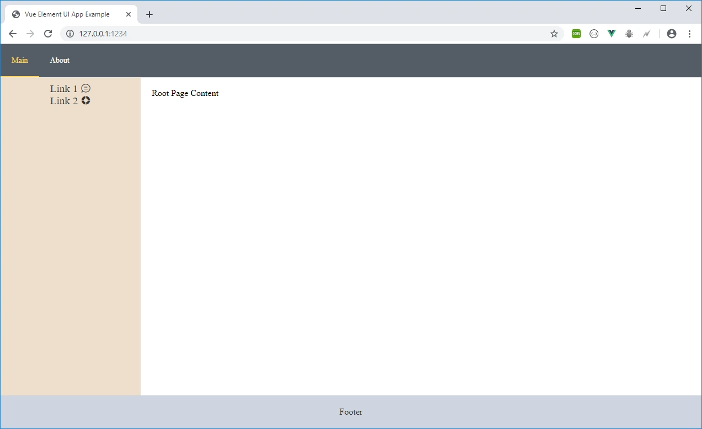

### About
Easy to use minimal Parcel Template for Vue.js Element UI projects.
If you will use it on Unix systems you need replace prebuild command `"prebuild": "rmdir /s/q dist"` in `package.json` to `"prebuild": "rm -rf dist"`

### Usage
`npm install`

`npm run start`

`parcel build src/index.html`

**Dependencies**:
```
    "axios": "^0.18.0",
    "element-ui": "^2.8.2",
    "parcel-bundler": "^1.12.3",
    "vue": "^2.6.10",
    "vue-hot-reload-api": "^2.3.3",
    "vue-router": "^3.0.6",
    "vuex": "^3.1.0"
```

How it's look like:

